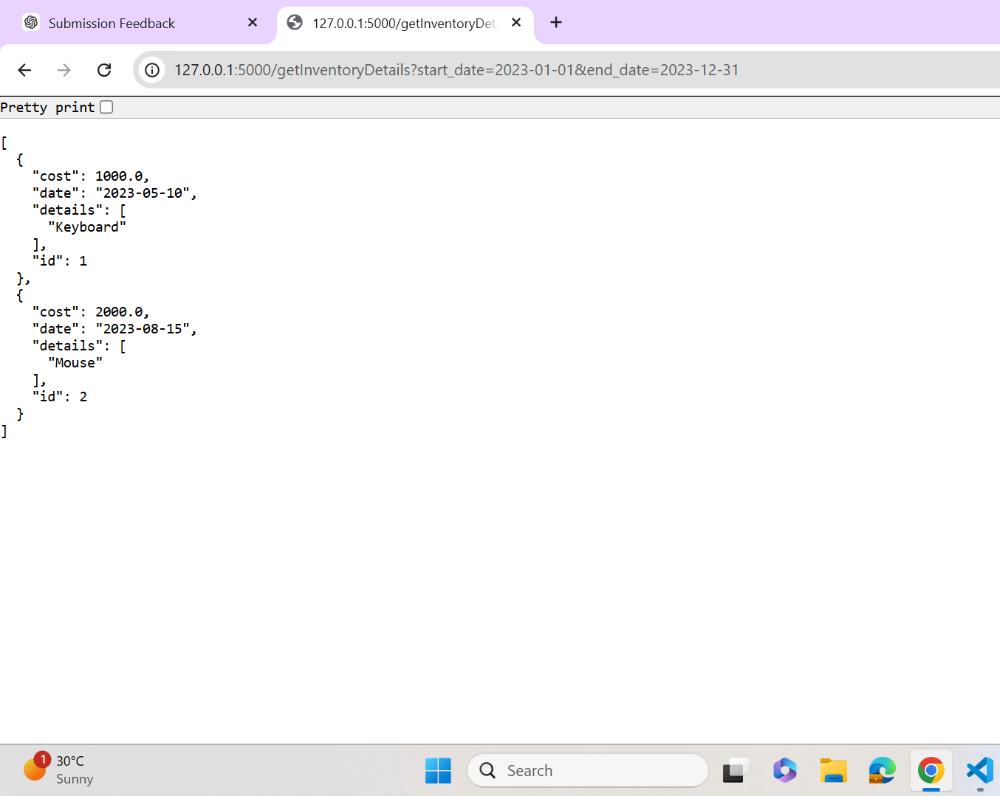
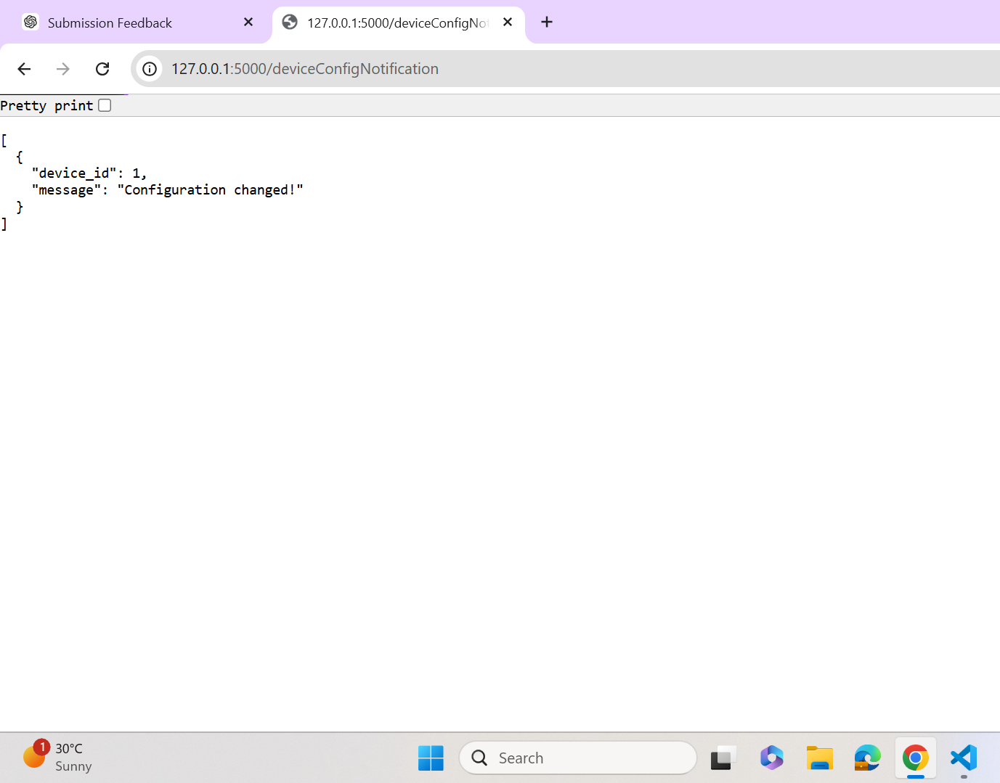
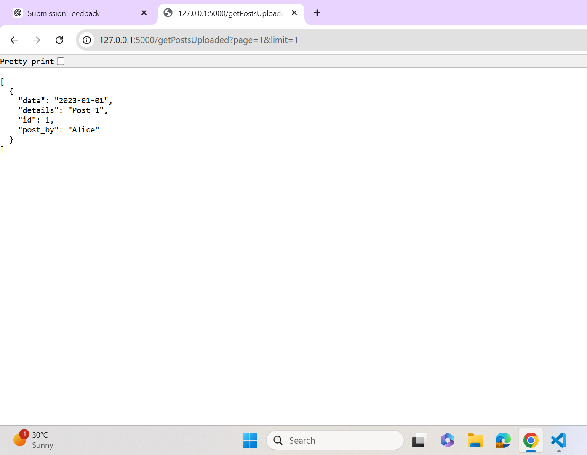

# 🚀 Flask Assignment (Q1, Q2, Q3)

## 📌 Overview

This project implements three APIs using Flask and SQLAlchemy:

* Inventory Management System
* Device Configuration Notification
* Social Networking (Posts API)

---

## 🧩 Question 1: Inventory API

### 🔹 Features

* Fetch inventory using date filter
* Includes related item details

### 📡 Endpoint

GET /getInventoryDetails?start_date=YYYY-MM-DD&end_date=YYYY-MM-DD

### ✅ Sample Output

```json
[
  {
    "id": 1,
    "date": "2023-05-10",
    "cost": 1000.0,
    "details": ["Keyboard"]
  }
]
```

---

## 🔔 Question 2: Device Notification API

### 🔹 Features

* Returns devices where configuration changed

### 📡 Endpoint

GET /deviceConfigNotification

### ✅ Sample Output

```json
[
  {
    "device_id": 1,
    "message": "Configuration changed!"
  }
]
```

---

## 🌐 Question 3: Social Networking API (Posts)

### 🔹 Features

* Fetch posts uploaded by users
* Pagination using page & limit
* Simulates social media feed

### 📡 Endpoint

GET /getPostsUploaded?page=1&limit=5

### ✅ Sample Output

```json
[
  {
    "id": 1,
    "post_by": "Alice",
    "date": "2023-01-01",
    "details": "Post 1"
  }
]
```

---

## 🧠 Database Design

### Tables Used:

* Inventory
* InventoryDetails
* Devices
* Posts

---

## 🖼️ Screenshots

### Inventory API



### Device Notification



### Posts API



---

## ⚙️ How to Run

pip install -r requirements.txt
python app.py

---

## 👩‍💻 Author

Priyanshi Gupta
